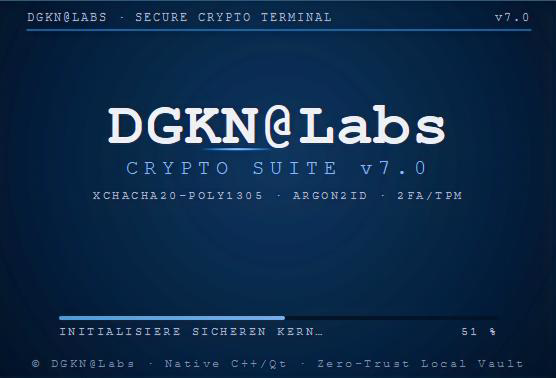
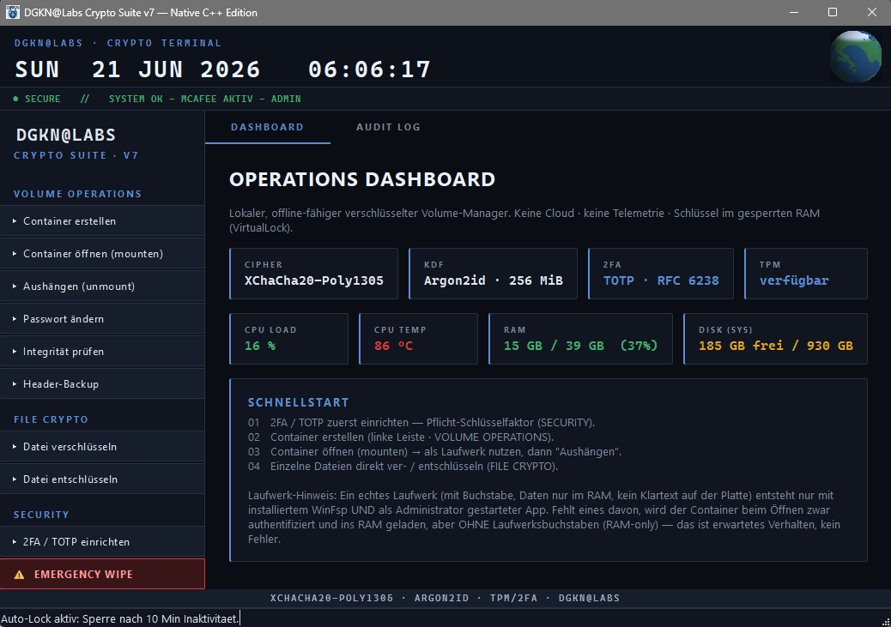

**🌐 Sprache:** [English](README.md) · **Deutsch**

# DGKN@Labs · Crypto Suite v7

**Lokal. Offline. Kompromisslos. — Native C++ Edition**

---

> ⚠️ **Evaluations-Vorschau — ein Lernprojekt, keine auditierte Software.**
> Bitte (noch) keine echten, wertvollen Daten damit schützen. Details unten unter
> *„Wie und warum dieses Projekt entstanden ist"*.

## Was ist das?

Die DGKN Crypto Suite ist ein **lokaler, sicherheitsorientierter Manager für verschlüsselte
Container** für Windows, vollständig in **nativem C++** mit einer **Qt-6**-Oberfläche
geschrieben. Dateien liegen in verschlüsselten Containern, die sich nur mit dem richtigen
Passwort **plus** dem gebundenen 2FA-Geheimnis öffnen lassen.

> **Keine Cloud. Keine Telemetrie. Keine Backdoors. Deine Daten bleiben deine.**

  
   
  <em>Das Betriebs-Dashboard — Krypto-Konfigurationskacheln plus Live-Systemmetriken.</em>

## Kernfunktionen

| Funktion | Details |
|---|---|
| 🔐 **Verschlüsselung** | XChaCha20-Poly1305 (authentifiziert, erkennt Manipulation) |
| 🔑 **Schlüsselableitung** | Argon2id (speicherhart, 256 MiB) + HKDF-SHA256 — GPU/ASIC-resistent |
| 🔒 **Mehrfaktor-Bindung** | Passwort + 2FA-Geheimnis. *(TPM/Geräte-ID sind im Kern implementiert, aber in der v7-GUI noch nicht aktivierbar.)* |
| 🫥 **Glaubhafte Abstreitbarkeit** | Versteckte Volumes mit schlüssel-gesalzenen HMAC-Offsets |
| 🛡️ **Voll verschlüsselter Header** | Keine Klartext-Magic-Bytes — nicht von Zufall unterscheidbar |
| 💾 **Virtuelles Laufwerk** | Entschlüsselte Daten leben **nur im RAM** (WinFsp) — kein Klartext auf der Platte |
| 🧠 **Sicherer Speicher** | Schlüssel via `sodium_mlock` im RAM gehalten, mit `sodium_memzero` gelöscht |
| ⏱️ **Brute-Force-Schutz** | Persistente Sperre + exponentielles Backoff (übersteht Neustarts) |
| 🆘 **Notfallmodus** | Sofortiges Aushängen + optionale Header-Bereinigung; Duress-Passwort |
| 🖥️ **Native Oberfläche** | Qt 6 Widgets, dunkles Theme, kein Web/Electron-Ballast |

Die vollständige Funktionsliste, das Bedrohungsmodell und der Bauablauf stehen in der
**[englischen README](README.md)** und in **[SECURITY.md](SECURITY.md)**.

## Sicherheit — ehrliche Einordnung

Das kryptografische Design ist stark und gehärtet (authentifizierte Verschlüsselung auf
jeder Ebene, speicherharte KDF, voll verschlüsselter Header). **Aber:** DGKN ist
**Windows-only, neu und noch nicht unabhängig auditiert**. „Military/forensic grade" ist
ein Ziel, das durch **externe Prüfung verdient** werden muss (Common Criteria / FIPS 140-3),
keine Eigenschaft, die ich mir selbst zuspreche. Für wirklich schützenswerte Daten nutze
heute lieber auditierte Werkzeuge wie VeraCrypt, bis DGKN extern geprüft wurde.

## Installation

Lade die **`DGKN-Setup.exe`** aus dem [neuesten Release](../../releases) und führe sie aus.

> **⚠️ SmartScreen-Warnung ist normal (selbstsigniert).** Da das Setup mit meinem eigenen,
> selbstsignierten Zertifikat signiert ist (kein bezahltes CA-Zertifikat), zeigt Windows
> „Der Computer wurde durch Windows geschützt / unbekannter Herausgeber". Das ist **kein**
> Malware-Hinweis — klicke **Weitere Informationen → Trotzdem ausführen**. Den
> Zertifikat-Fingerprint und die SHA-256-Prüfsumme zum Verifizieren findest du in den
> Release-Notes.

> **Für das virtuelle Laufwerk:** installiere **WinFsp** (<https://winfsp.dev>).
> **Admin-Rechte sind nicht nötig** — WinFsp bindet den Laufwerksbuchstaben in deiner
> eigenen Benutzersitzung ein. Fehlt WinFsp (oder ist kein Laufwerksbuchstabe frei),
> funktionieren Datei- und Container-Krypto trotzdem; der Container wird dann **nur im RAM**
> gehalten — es wird kein Laufwerksbuchstabe eingebunden.

## Lizenz

Der **eigene Code** von DGKN ist **freie Software** unter der **GNU General Public License
v3.0 (GPLv3)** — siehe **[LICENSE](LICENSE)**. Kurz: Du darfst die Software **nutzen,
studieren, weitergeben und verändern** (auch kommerziell). Wer das Programm oder eine
veränderte Fassung weitergibt, muss dieselben **GPLv3-Freiheiten** weiterreichen und den
zugehörigen **Quellcode** verfügbar machen. Die Software kommt **ohne jede Gewährleistung**.
Die verwendeten Open-Source-Bibliotheken behalten ihre eigenen Lizenzen — siehe
**[THIRD-PARTY-NOTICES.txt](THIRD-PARTY-NOTICES.txt)**.

---

## Wie und warum dieses Projekt entstanden ist (volle Transparenz)

Mir ist Ehrlichkeit hier wichtig — gerade gegenüber Sicherheitsforschern, die sich den Code
ansehen:

- **Ich habe das hier nebenbei gebaut.** Ich arbeite **Vollzeit** in einem anderen Beruf;
  dieses Projekt ist in meiner Freizeit entstanden, aus Interesse und um zu lernen.
- **Ich stehe noch am Anfang meiner Coding-Reise.** Ich eigne mir das Programmieren nach und
  nach an und habe DGKN bewusst als anspruchsvolles Lernprojekt gewählt — mir ist klar, dass
  Verschlüsselungssoftware mit zu dem Schwersten und Folgenreichsten gehört, was man bauen
  kann.
- **Entstanden mit Hilfe verschiedener KI-Modelle.** Ich habe KI genutzt, um Code zu
  schreiben, zu erklären und zu prüfen — und arbeite daran, ihn wirklich zu *verstehen*,
  statt nur zu kopieren. Das „Warum" hinter jeder Zeile zu begreifen, ist für mich der
  eigentliche Sinn der Übung.
- **Inspiriert von TrueCrypt / VeraCrypt.** Deren Idee starker, lokaler, cloud-freier
  verschlüsselter Volumes hat mich auf diesen Weg gebracht. DGKN ist meine eigene,
  unabhängige C++-Umsetzung und teilt keinen Code mit ihnen.

### An Sicherheitsforscher: bitte geht hart damit um

Wenn du Sicherheitsforscher\*in bist: **Seid kritisch — das ist eure Aufgabe, und genau das
inspiriert mich.** Knallharte Bug-Reports, Design-Kritik und „das ist falsch, weil…" sind
ausdrücklich willkommen. Findet Schwächen, brecht es, sagt mir wo es hakt. Genau dieser
kritische Blick treibt das Projekt — und mich — voran. Das Bedrohungsmodell und ein
Schritt-für-Schritt-Selbstaudit stehen in **[SECURITY.md](SECURITY.md)**.

Ein herzliches Dankeschön an alle, die sich die Zeit nehmen, das auszuprobieren und ehrliches
Feedback zu geben. 🙏

---

Mit Paranoia gebaut. Mit Absicht getestet. 
<b>DGKN@Labs</b> · <a href="https://github.com/dogenc">GitHub @dogenc</a>

